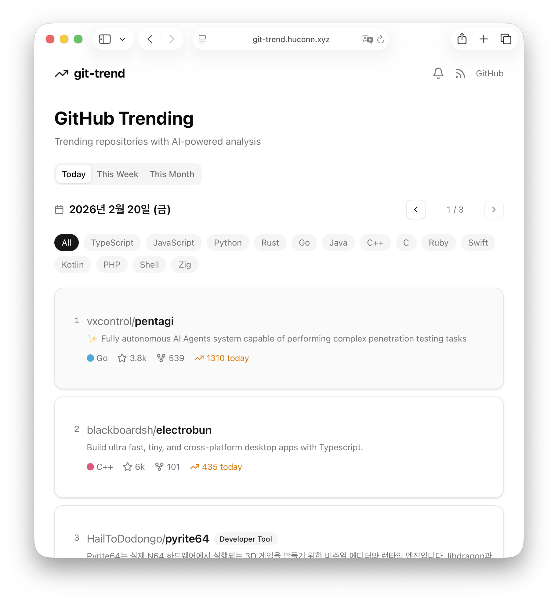

# git-trend

GitHub Trending 레포지토리를 자동 수집하고, AI(Claude 4 Sonnet via Replicate)로 분석하여 한국어/영어 요약을 제공하는 웹사이트.



## 주요 기능

- **트렌딩 수집** — GitHub Trending 페이지를 크롤링하여 daily/weekly/monthly 트렌딩 레포를 자동 수집
- **AI 분석** — 각 레포의 README, 파일 구조, 기술 스택을 분석하여 한국어/영어 요약, 카테고리 분류, 난이도 평가 제공
- **스타 히스토리** — 레포별 스타 추이를 차트로 시각화
- **RSS 피드** — 트렌딩 레포를 RSS로 구독 가능
- **Webhook 알림** — Slack, Discord 등으로 새로운 트렌딩 레포 알림 발송

## 기술 스택

| 구분 | 기술 |
|------|------|
| Framework | Next.js 15 (App Router) |
| Language | TypeScript |
| UI | Tailwind CSS v4 + shadcn/ui |
| DB | Drizzle ORM + Turso (SQLite) |
| AI | Replicate API (anthropic/claude-4-sonnet) |
| Scraping | Cheerio |
| Chart | Recharts |
| Deploy | Vercel |

## 시작하기

### 1. 설치

```bash
git clone https://github.com/hulryung/git-trend.git
cd git-trend
npm install
```

### 2. 환경변수 설정

```bash
cp .env.example .env.local
```

`.env.local`을 열고 아래 값을 채워주세요:

```
REPLICATE_API_TOKEN=r8_xxx        # Replicate API 토큰 (필수)
GITHUB_TOKEN=ghp_xxx              # GitHub PAT (권장, rate limit 완화)
TURSO_DATABASE_URL=file:local.db  # 로컬 개발 시 그대로 사용
CRON_SECRET=dev-secret            # 크론 엔드포인트 보호용
```

### 3. DB 마이그레이션

```bash
npx drizzle-kit push
```

### 4. 개발 서버 실행

```bash
npm run dev
```

`http://localhost:3000`에서 확인할 수 있습니다.

### 5. 데이터 수집 및 분석

```bash
# 트렌딩 데이터 수집
curl http://localhost:3000/api/cron/collect -H "Authorization: Bearer dev-secret"

# AI 분석 실행 (배치당 5개)
curl http://localhost:3000/api/cron/analyze -H "Authorization: Bearer dev-secret"
```

## API 엔드포인트

| Method | Path | 설명 |
|--------|------|------|
| GET | `/api/trending?period=daily&language=Python` | 트렌딩 목록 |
| GET | `/api/repo/:owner/:name` | 레포 상세 + AI 분석 |
| GET | `/feed/rss.xml?period=daily&language=Rust` | RSS 피드 |
| POST | `/api/webhook` | Webhook 등록 |
| DELETE | `/api/webhook` | Webhook 삭제 |
| GET | `/api/cron/collect` | 트렌딩 수집 (크론) |
| GET | `/api/cron/analyze` | AI 분석 (크론) |

## 프로젝트 구조

```
src/
├── app/                    # Next.js App Router
│   ├── page.tsx            # 메인 (트렌딩 리스트)
│   ├── repo/[owner]/[name] # 레포 상세 페이지
│   ├── feed/rss.xml        # RSS 피드
│   └── api/                # API 라우트
├── lib/
│   ├── collectors/         # GitHub Trending 크롤러
│   ├── analyzer/           # Replicate AI 분석
│   ├── notifications/      # RSS, Webhook
│   └── db/                 # Drizzle ORM 스키마
└── components/             # React 컴포넌트
```

## Vercel 배포

```bash
vercel deploy
```

환경변수를 Vercel 대시보드에서 설정하면 크론이 자동으로 동작합니다:

- `/api/cron/collect` — 매 6시간
- `/api/cron/analyze` — 매 6시간 (30분 오프셋)

## License

MIT
